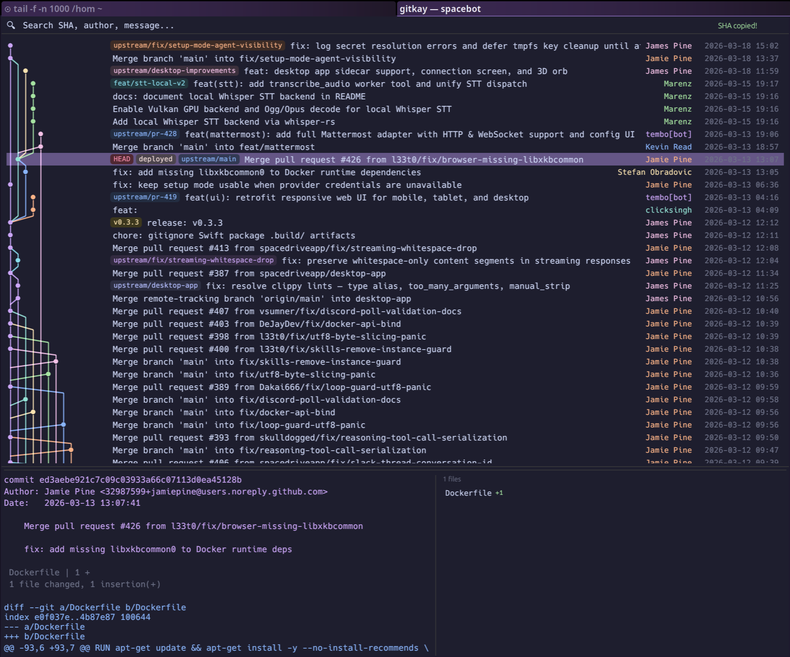

<h1 align="center">
  <br>
  gitkay
  <br>
</h1>

<h3 align="center">gitk, but okay.</h3>

<p align="center">
  A fast, native Wayland git history viewer built with Rust.
</p>

<p align="center">
  <a href="#features">Features</a> •
  <a href="#install">Install</a> •
  <a href="#usage">Usage</a> •
  <a href="#why">Why</a> •
  <a href="#license">License</a>
</p>

<p align="center">
  
</p>

---

## Why?

**gitk** is a Tcl/Tk app from 2005. On Wayland it needs XWayland, has stale X11 selection bugs, and looks like it time-traveled from Windows 98.

**gitkay** is what gitk would be if it was written today:

- Native Wayland — no XWayland, no Tk, no X11 selection bugs
- Starts in **under 200ms** — lazy loading, precomputed ref maps
- Catppuccin Mocha dark theme that matches your rice
- Written in Rust, single binary, zero config

## Features

### Commit Graph
- Color-coded branch lanes with consistent colors across column shifts
- Merge/branch diagonals rendered cleanly — no stubs, no gaps, no false branches
- Lane-based layout: first parent always continues straight down
- Convergence detection when multiple branches meet at one commit
- Virtual scrolling with lazy loading — handles repos with thousands of commits

### Diff Viewer
- Syntax-highlighted diffs: additions in green, deletions in red, hunk headers in blue, file headers in yellow
- File list sidebar with per-file `+/-` stats
- Click a file to jump to its diff section
- Commit header with author, date, full message

### Search
- Full-width search bar — filter by SHA, author, commit message, branch name, tag name
- Press **Enter** to cycle through matches with `3/42` counter
- Matching commits highlighted in the graph

### Quality of Life
- **Click a commit** to copy its SHA to both clipboard and primary selection
- **Auto-select** first commit on startup with diff shown
- **Lazy loading** — starts with 200 commits, loads more as you scroll
- **Unique author colors** — each contributor gets a distinct color
- **Unique ref colors** — each branch/remote gets its own color with readable contrast
- **Ref badges** — colored labels for HEAD, branches, remotes, tags
- **Hover effects** — file list highlights on hover with full path tooltip

## Install

### From source (recommended)

```sh
git clone https://github.com/Marenz/gitkay
cd gitkay
cargo build --release
sudo cp target/release/gitkay /usr/local/bin/
```

### Build dependencies

**openSUSE Tumbleweed:**
```sh
sudo zypper install gtk4-devel libgraphene-devel openssl-devel
```

**Ubuntu / Debian:**
```sh
sudo apt install libgtk-4-dev libgraphene-1.0-dev libssl-dev pkg-config cmake
```

**Fedora:**
```sh
sudo dnf install gtk4-devel graphene-devel openssl-devel
```

### openSUSE RPM

```sh
rpmbuild -ba packaging/gitkay.spec
sudo rpm -i ~/rpmbuild/RPMS/x86_64/gitkay-*.rpm
```

### Ubuntu / Debian .deb

```sh
dpkg-buildpackage -us -uc -b
sudo dpkg -i ../gitkay_*.deb
```

## Usage

```sh
# Inside a git repo
gitkay

# Or specify a path
gitkay /path/to/repo
```

### Controls

| Action | Effect |
|---|---|
| **Click** commit | Select, show diff, copy SHA to clipboard |
| **Scroll** | Browse history (lazy loads more commits) |
| **Type** in search bar | Filter by SHA / author / message / branch / tag |
| **Enter** in search | Cycle through matches |
| **Click** file in sidebar | Jump to file's diff section |
| **Hover** file in sidebar | Full path tooltip |

## Architecture

Single-file Rust app (~1600 lines) with 14 unit tests:

- **egui** + **eframe** — native Wayland window with wgpu rendering
- **git2** (libgit2) — repository access, revwalk, diff
- **chrono** — date formatting
- **arboard** — clipboard (both clipboard and primary selection)

The graph layout uses a pipe-based algorithm where each lane tracks an OID and a persistent color index. First parent always continues in the same column. Colors survive column shifts. Convergence is detected when multiple lanes point to the same commit.

## License

[MIT](LICENSE)
